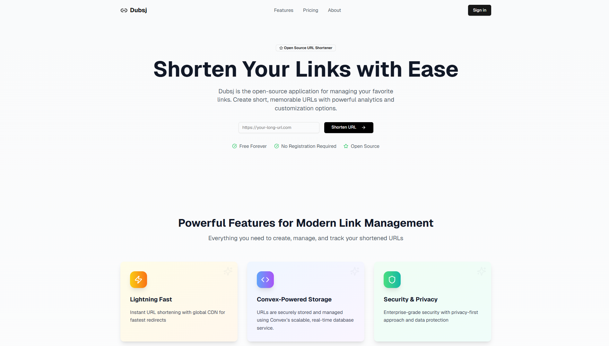
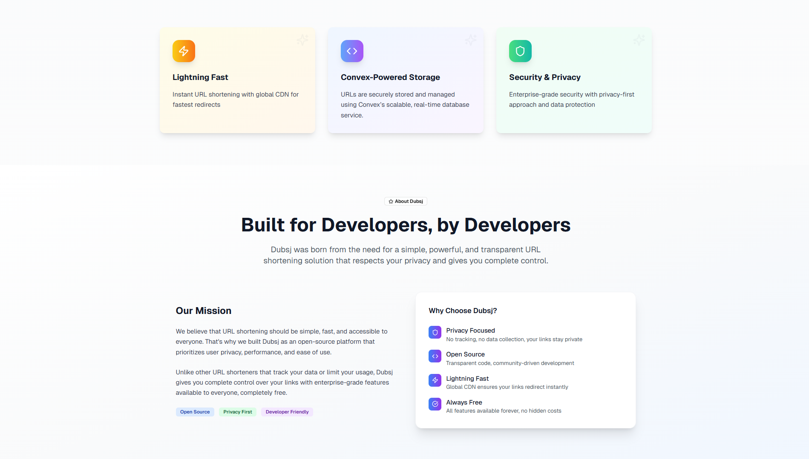
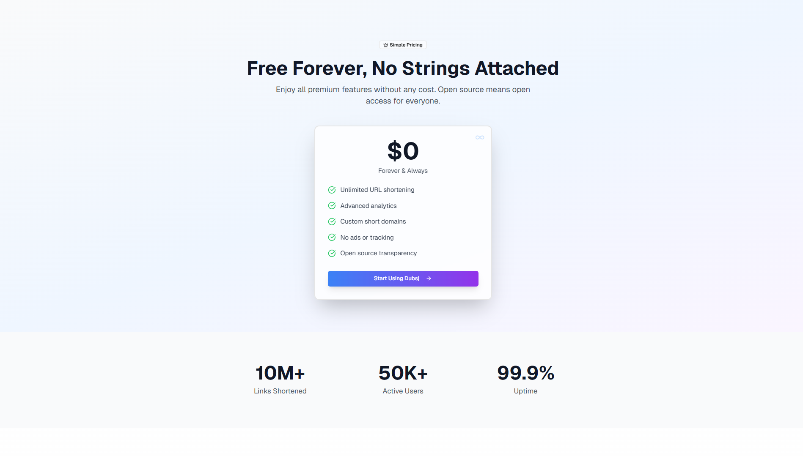
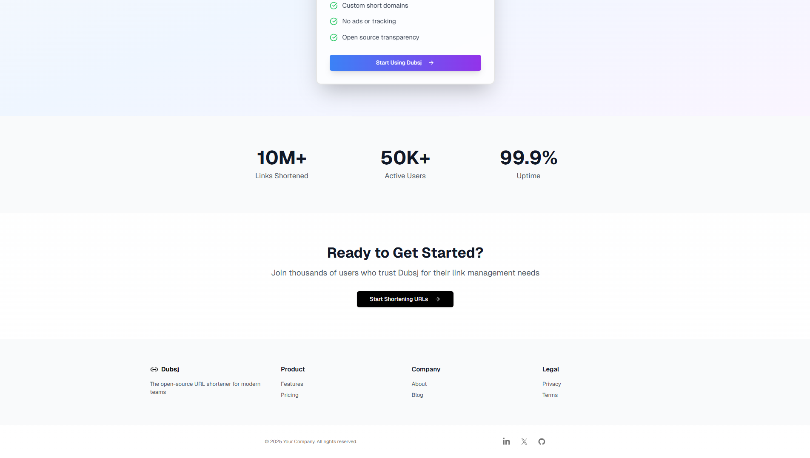
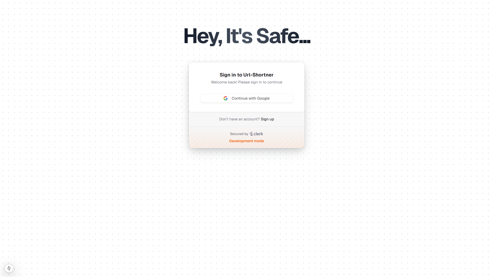
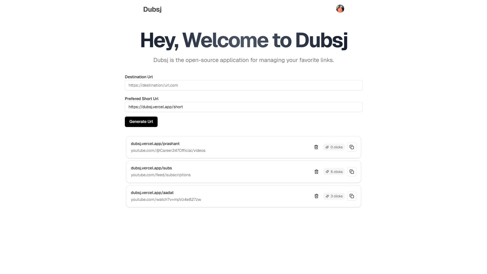

# 🔗 Dubsj

> An open-source application for managing your favorite links

[](https://nextjs.org/)
[](https://www.typescriptlang.org/)
[](https://tailwindcss.com/)
[](LICENSE)

## 📋 Table of Contents

- [Overview](#overview)
- [Features](#features)
- [Tech Stack](#tech-stack)
- [Getting Started](#getting-started)
  - [Prerequisites](#prerequisites)
  - [Installation](#installation)
  - [Development](#development)
- [Project Structure](#project-structure)
- [Usage](#usage)
- [Configuration](#configuration)
- [Deployment](#deployment)
- [Contributing](#contributing)
- [License](#license)
- [Contact](#contact)

## 🌟 Overview

Dubsj is a modern, open-source link management application built with Next.js 14+. It provides a clean and intuitive interface for organizing, categorizing, and accessing your favorite links all in one place. Whether you're a developer, researcher, or content creator, Dubsj helps you keep your important URLs organized and easily accessible.

## ✨ Features

- 🔐 **Secure Link Management** - Store and organize your favorite links securely
- 📁 **Categories & Tags** - Organize links with custom categories and tags
- 🔍 **Advanced Search** - Quickly find any link with powerful search functionality
- ⚡ **Real-time Sync** - Powered by Convex for instant data synchronization across devices
- 📱 **Responsive Design** - Works seamlessly across desktop, tablet, and mobile devices
- 🎨 **Modern UI** - Beautiful interface built with shadcn/ui components
- 📝 **MDX Blog Support** - Built-in blog functionality using MDX
- ⚡ **Fast Performance** - Optimized with Next.js App Router and Server Components
- 🌙 **Dark Mode** - Built-in dark mode support for comfortable viewing
- 🔄 **Import/Export** - Easily backup and restore your link collection
- 🎯 **User-Friendly** - Intuitive interface designed for simplicity and efficiency

## 🛠 Tech Stack

### Core Technologies

- **[Next.js 14+](https://nextjs.org/)** - React framework with App Router
- **[TypeScript](https://www.typescriptlang.org/)** - Type-safe JavaScript
- **[React 18+](https://react.dev/)** - UI library
- **[Tailwind CSS](https://tailwindcss.com/)** - Utility-first CSS framework

### UI Components & Styling

- **[shadcn/ui](https://ui.shadcn.com/)** - Beautifully designed components
- **[Radix UI](https://www.radix-ui.com/)** - Unstyled, accessible component primitives
- **[Lucide Icons](https://lucide.dev/)** - Beautiful & consistent icon toolkit

### Content & Data

- **[MDX](https://mdxjs.com/)** - Markdown for the component era
- **[next-mdx-remote](https://github.com/hashicorp/next-mdx-remote)** - MDX rendering for Next.js

### Backend & Database

- **[Convex](https://www.convex.dev/)** - Real-time database as a service with built-in backend functionality
  - Real-time data synchronization
  - Serverless backend
  - TypeScript-first database
  - Built-in authentication support

### Additional Tools

- **ESLint** - Code linting
- **Prettier** - Code formatting
- **TypeScript** - Static type checking

## 🚀 Getting Started

### Prerequisites

Before you begin, ensure you have the following installed:

- **Node.js** (version 18.x or higher)
- **npm** / **yarn** / **pnpm** / **bun** (package manager)
- **Git** (for cloning the repository)

### Installation

1. **Clone the repository**

```bash
git clone https://github.com/surajb1515/dub.sj.git
cd dub.sj
```

2. **Install dependencies**

Using npm:
```bash
npm install
```

Using yarn:
```bash
yarn install
```

Using pnpm:
```bash
pnpm install
```

Using bun:
```bash
bun install
```

3. **Set up environment variables**

Create a `.env.local` file in the root directory:

```env
# App Configuration
NEXT_PUBLIC_APP_URL=http://localhost:3000

# Convex Configuration
CONVEX_DEPLOYMENT=your_convex_deployment_url
NEXT_PUBLIC_CONVEX_URL=your_public_convex_url

# Add other required environment variables
```

4. **Set up Convex**

```bash
# Install Convex CLI globally
npm install -g convex

# Initialize Convex in your project
npx convex dev

# This will:
# - Create a convex/ directory
# - Set up your Convex deployment
# - Start the Convex dev server
```

### Development

Run the development server:

```bash
npm run dev
# or
yarn dev
# or
pnpm dev
# or
bun dev
```

**Important:** Make sure Convex dev server is also running:

```bash
npx convex dev
```

This will start both your Next.js application and Convex backend in development mode with real-time synchronization.

Open [http://localhost:3000](http://localhost:3000) in your browser to see the application.

## 📁 Project Structure

```
dub.sj/
├── app/                    # Next.js App Router
│   ├── (auth)/            # Authentication routes
│   ├── (dashboard)/       # Dashboard routes
│   ├── api/               # API routes
│   ├── blog/              # Blog pages (MDX)
│   ├── layout.tsx         # Root layout
│   └── page.tsx           # Home page
├── components/            # React components
│   ├── ui/               # shadcn/ui components
│   ├── layout/           # Layout components
│   └── shared/           # Shared components
├── convex/               # Convex backend
│   ├── schema.ts        # Database schema
│   ├── links.ts         # Link-related functions
│   ├── auth.ts          # Authentication functions
│   └── _generated/      # Auto-generated types
├── content/              # MDX content files
│   └── blog/            # Blog posts
├── lib/                  # Utility functions
│   ├── utils.ts         # Helper functions
│   └── hooks/           # Custom React hooks
├── public/              # Static assets
│   ├── images/         # Image files
│   └── icons/          # Icon files
├── styles/             # Global styles
│   └── globals.css     # Global CSS
├── types/              # TypeScript type definitions
├── .env.local          # Environment variables (local)
├── .env.example        # Example environment variables
├── convex.json         # Convex configuration
├── next.config.js      # Next.js configuration
├── tailwind.config.ts  # Tailwind CSS configuration
├── tsconfig.json       # TypeScript configuration
└── package.json        # Project dependencies
```

## 📖 Usage

### Adding Links

1. Navigate to the dashboard
2. Click on "Add Link" button
3. Fill in the link details (URL, title, description, category)
4. Click "Save" to add the link to your collection

### Organizing Links

- **Categories**: Create custom categories to group related links
- **Tags**: Add tags to links for more granular organization
- **Search**: Use the search bar to quickly find specific links
- **Filters**: Apply filters to view links by category or tag

### Creating Blog Posts

Blog posts are written in MDX format and stored in the `content/blog/` directory:

1. Create a new `.mdx` file in `content/blog/`
2. Add frontmatter metadata:

```mdx
---
title: "Your Blog Post Title"
description: "A brief description"
date: "2025-01-15"
author: "Your Name"
tags: ["tag1", "tag2"]
---

Your blog content here...
```

3. The post will automatically appear in the blog section

## ⚙️ Configuration

### Convex Database

Define your database schema in `convex/schema.ts`:

```typescript
import { defineSchema, defineTable } from "convex/server";
import { v } from "convex/values";

export default defineSchema({
  links: defineTable({
    url: v.string(),
    title: v.string(),
    description: v.optional(v.string()),
    category: v.string(),
    tags: v.array(v.string()),
    userId: v.string(),
    createdAt: v.number(),
  }).index("by_user", ["userId"]),
  
  categories: defineTable({
    name: v.string(),
    userId: v.string(),
  }).index("by_user", ["userId"]),
});
```

Create Convex functions in `convex/links.ts`:

```typescript
import { query, mutation } from "./_generated/server";
import { v } from "convex/values";

export const getLinks = query({
  args: {},
  handler: async (ctx) => {
    return await ctx.db.query("links").collect();
  },
});

export const addLink = mutation({
  args: {
    url: v.string(),
    title: v.string(),
    description: v.optional(v.string()),
    category: v.string(),
    tags: v.array(v.string()),
  },
  handler: async (ctx, args) => {
    const linkId = await ctx.db.insert("links", {
      ...args,
      userId: "current-user-id", // Replace with actual auth
      createdAt: Date.now(),
    });
    return linkId;
  },
});
```

### Tailwind CSS

Customize your theme in `tailwind.config.ts`:

```typescript
export default {
  theme: {
    extend: {
      colors: {
        // Add custom colors
      },
      // Add other customizations
    },
  },
  plugins: [],
}
```

### Next.js

Configure Next.js settings in `next.config.js`:

```javascript
/** @type {import('next').NextConfig} */
const nextConfig = {
  // Add your configurations here
}

module.exports = nextConfig
```

## 🚢 Deployment

### Vercel (Recommended)

The easiest way to deploy your Next.js app with Convex is using [Vercel](https://vercel.com):

1. **Deploy Convex Backend**
   ```bash
   npx convex deploy
   ```
   This will give you a production Convex deployment URL.

2. **Push your code to GitHub**

3. **Import your repository in Vercel**

4. **Configure environment variables in Vercel:**
   ```
   CONVEX_DEPLOYMENT=your_production_convex_deployment
   NEXT_PUBLIC_CONVEX_URL=your_production_convex_url
   ```

5. **Deploy your application**

[](https://vercel.com/new/clone?repository-url=https://github.com/surajb1515/dub.sj)

### Other Platforms

You can also deploy to:

- **Netlify**
- **Railway**
- **AWS Amplify**
- **Digital Ocean**
- **Self-hosted** using Docker

### Build for Production

```bash
npm run build
npm run start
```

## 🤝 Contributing

Contributions are welcome! Here's how you can help:

1. **Fork the repository**
2. **Create a feature branch**
   ```bash
   git checkout -b feature/amazing-feature
   ```
3. **Commit your changes**
   ```bash
   git commit -m 'Add some amazing feature'
   ```
4. **Push to the branch**
   ```bash
   git push origin feature/amazing-feature
   ```
5. **Open a Pull Request**

### Development Guidelines

- Follow the existing code style
- Write meaningful commit messages
- Add tests for new features
- Update documentation as needed
- Ensure all tests pass before submitting PR

## 📝 License

This project is licensed under the MIT License - see the [LICENSE](LICENSE) file for details.

## 👤 Contact

**Suraj** - [@surajb1515](https://github.com/surajb1515)

Project Link: [https://github.com/surajb1515/dub.sj](https://github.com/surajb1515/dub.sj)

## 🙏 Acknowledgments

- [Next.js](https://nextjs.org/) - The React Framework
- [Convex](https://www.convex.dev/) - Real-time backend as a service
- [shadcn/ui](https://ui.shadcn.com/) - Beautiful UI components
- [Tailwind CSS](https://tailwindcss.com/) - Utility-first CSS
- [Vercel](https://vercel.com/) - Deployment platform
- All contributors who help improve this project

## 📊 Project Stats


---

<div align="center">
  Made with ❤️ by <a href="https://github.com/surajb1515">Suraj</a>
</div>